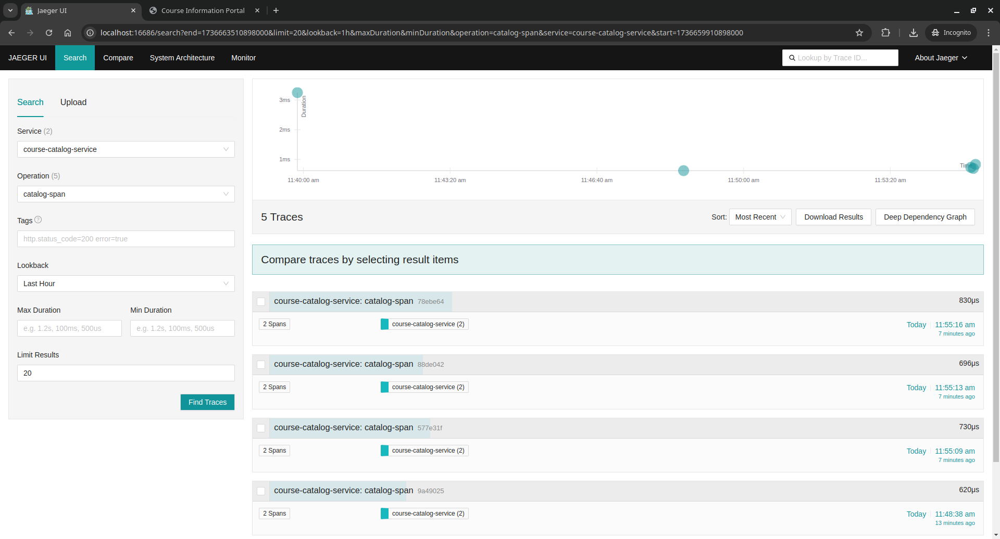
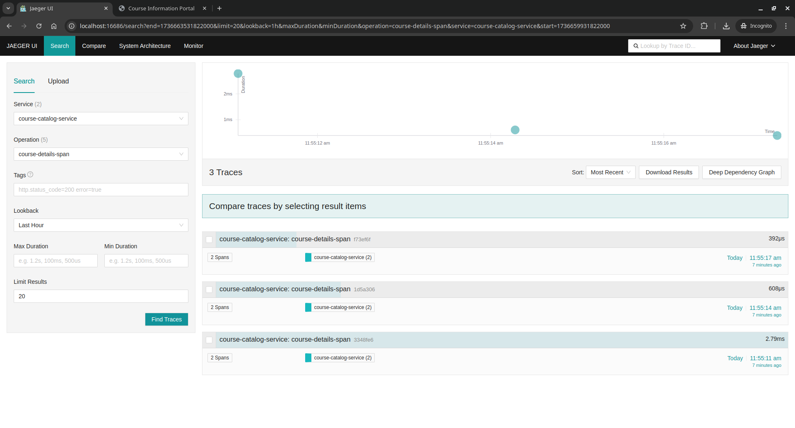

## CS203 Lab Assignment 1

#### Data Collection using OpenTelemetry and Jaeger

---

**[Github repository](https://github.com/Reckadon/STT-Assignment1-DataCollection)**

**_Team Members_**
Name | Roll Number
---|---
Romit Mohane | 23110279
Rudra Pratap Singh | 23110281

---

#### Features Implemented

---

### 1. Add Courses to the Catalog

- **Screenshot 1:** Homepage showing the "Add a New Course" button.  
  

- **Screenshot 2:** Form for manually entering new course details.  
  

- **Screenshot 3:** Confirmation message after successfully adding a course.  
    
  

- **Screenshot 4:** Error message displayed when required fields are missing.  
  

- **Screenshot 5:** Log output showing error and success messages for adding courses.  
    
  

---

### 2. OpenTelemetry Tracing

- **Screenshot 6:** Tracing data for the course catalog page request.  
  

- **Screenshot 7:** Tracing data for the "Add a New Course" form submission.  
  

- **Screenshot 8:** Tracing data for browsing course details.  
  

- **Screenshot 9:** OpenTelemetry spans with attributes (e.g., user IP, request methods, metadata).  
  

---

### 3. Exporting Telemetry Data to Jaeger

- **Screenshot 10:** Jaeger dashboard showing total requests to each route.  
    
    
    
  

- **Screenshot 11:** Jaeger dashboard showing total processing time for each operation.  
  

- **Screenshot 12:** Jaeger dashboard displaying error counts for missing form fields or other issues.  
  

- **Screenshot 13:** Example of structured logging output in JSON format.  
    
  

---

To Run:  
run the `app.py` file after installing the necessary dependencies:

- `flask`, `opentelemetry-instrumentation`, `opentelemetry-instrumentation-flask`, `opentelemetry-exporter-jaeger`
